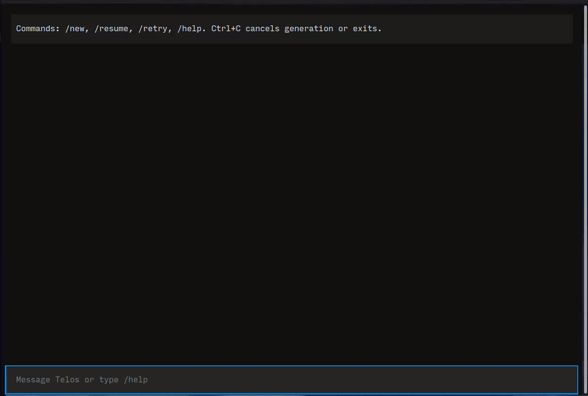

# Telos

A persistent, terminal-native career agent built with LangGraph, Ollama, PostgreSQL, and Textual.



Telos streams responses into a Markdown-rendered terminal conversation, persists chats across sessions, and supports cancellation and retry without losing the conversation thread.

## Features

- Streaming Textual TUI with Markdown responses
- Persistent chat history backed by PostgreSQL and LangGraph checkpoints
- Keyboard chat picker and transcript restoration
- `/new`, `/resume`, `/retry`, and `/help` commands
- Ctrl+C cancellation that closes the active provider stream
- Optional Langfuse tracing, including a distinct `Generation interrupted` status

## Requirements

- Python 3.12+
- [uv](https://docs.astral.sh/uv/)
- Docker and Docker Compose for PostgreSQL
- An Ollama model, either local or through Ollama Cloud

## Quick start

```sh
cp .env.example .env
make dev
```

Before running, set `OLLAMA_MODEL` in `.env`. For a local Ollama server running on the host, use:

```text
OLLAMA_BASE_URL=http://localhost:11434
OLLAMA_MODEL=<your-model>
```

For Ollama Cloud, use `https://ollama.com` as the base URL and set `OLLAMA_API_KEY`.

`make dev` starts PostgreSQL, runs Alembic migrations, initializes LangGraph checkpoint tables, and launches the Textual TUI.

## Using Telos

Type a message to start a chat. The chat is created only when the first message is sent.

| Command | Action |
| --- | --- |
| `/new` | Start a blank chat on the next message. |
| `/resume` or `/chats` | Open the keyboard chat picker. |
| `/retry` | Retry the current turn without adding another user message. |
| `/help` | Show command help in the transcript. |
| `Shift+Enter` or `Ctrl+J` | Insert a new line in the message composer. `Ctrl+J` works in terminals that do not distinguish Shift+Enter. |
| `Ctrl+C` | Cancel an active generation; otherwise exit. |
| `Esc` | Close the chat picker. |

## Architecture

```text
Textual TUI
    → ChatService
        → LangGraph async stream → ChatOllama
        → PostgreSQL metadata + AsyncPostgresSaver checkpoints
```

`chats` stores lightweight chat metadata. LangGraph checkpoints store the conversation messages, keyed by the same chat UUID. Resuming a chat restores its persisted transcript.

## Configuration

| Variable | Purpose |
| --- | --- |
| `OLLAMA_BASE_URL` | Ollama server or Cloud URL. |
| `OLLAMA_MODEL` | Required model name. |
| `OLLAMA_API_KEY` | Optional for local Ollama; required for authenticated Cloud access. |
| `DATABASE_URL` | PostgreSQL application database URL. |
| `LANGFUSE_SECRET_KEY` / `LANGFUSE_PUBLIC_KEY` / `LANGFUSE_BASE_URL` | Optional Langfuse tracing. |

## Development

```sh
make install          # install the locked environment
make test             # unit suite
make test-integration # PostgreSQL integration suite
make lint             # Ruff
make help             # all commands
```

The default test suite does not require PostgreSQL or a live Ollama provider. The integration suite requires the local PostgreSQL service.

## Observability

Set the Langfuse variables in `.env` to trace turns by Telos user and chat session. User-requested cancellation is recorded as `Generation interrupted`, not as a provider error.

## Limitations

- Ollama cancellation closes the client stream. Live provider-side cancellation still needs verification for the configured model.
- Tool-call streaming, multi-node streaming, resumable runs, and context trimming are not yet implemented.
